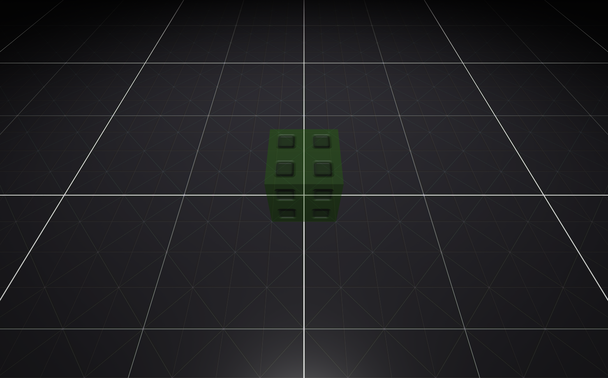

---
tags:
  - ClientObject
---

A part that forces a player to stand up if they are sitting.
# Config
None
# Tags
- `UnSitPart`
> [!warning] Deprecation Warning
> `UnSitPart` will be replaced by `StandPart` soon.
- `StandPart`